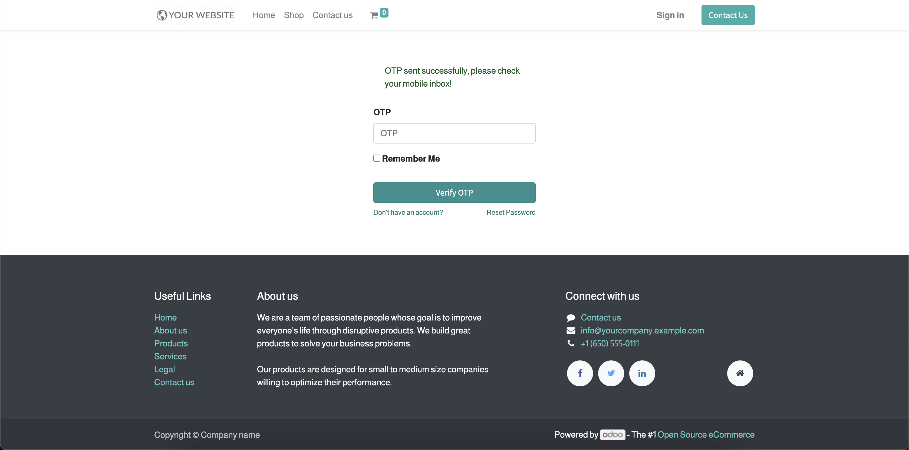
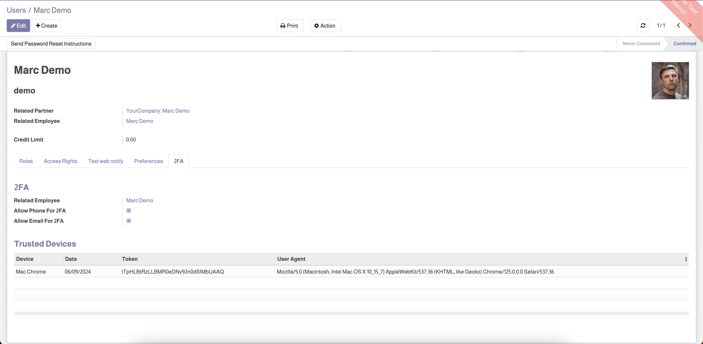
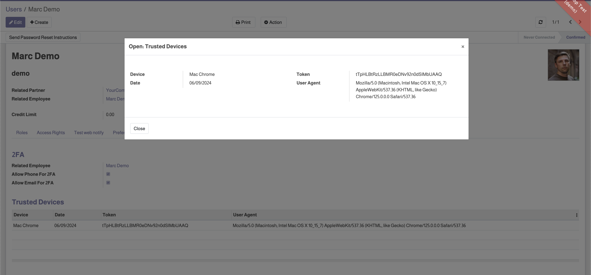
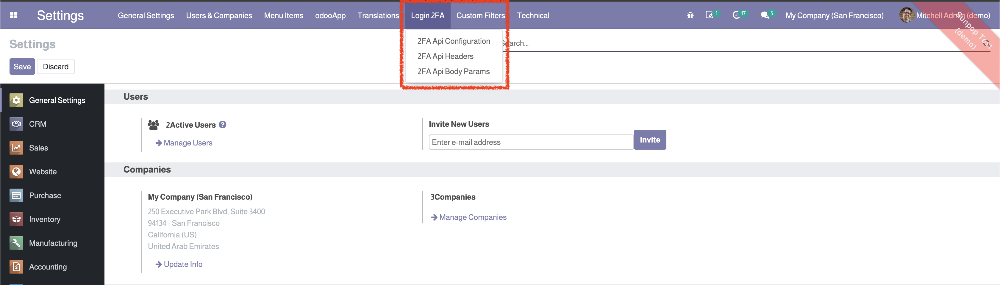
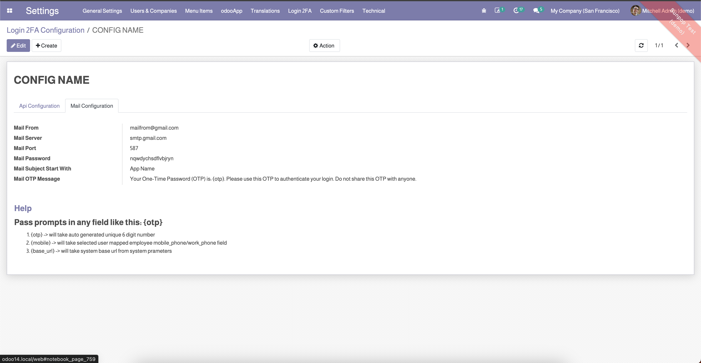

Pandora Login Via 2FA (Via Employee Mobile & Email)
===================================================

This module allows users to log in via two-factor authentication using their registered mobile phone number or email address.

Features
--------

- User authentication via OTP sent to mobile or email.
- Option to remember devices for future logins without OTP.
- Management of trusted devices.
- Configuration of SMS API and email server for OTP delivery.

Installation
------------

To install this module, follow these steps:

1. Ensure you have a running Odoo instance.
2. Copy the module folder `pandora_login_via_2fa` to your Odoo `addons` directory.
3. Update the module list by navigating to the Apps menu in Odoo and clicking on the 'Update Apps List' button.
4. Search for the module 'Pandora Login Via 2FA (Via Employee Mobile & Email)' and click 'Install'.

Configuration
-------------

To configure the module:

1. Go to the Odoo backend.
2. Navigate to **Settings > Login 2FA**.
3. Configure your SMS API and email server settings.

Usage
-----

1. When a user enters their username and password, they will be prompted to choose either their registered email or mobile number to receive an OTP.
2. After selecting the preferred method, an OTP will be sent to the chosen contact method.
3. The user will then enter the OTP on the next screen to complete the login process.
4. The 'Remember Me' option allows the user to save a token for future logins without requiring an OTP.
5. Trusted devices and tokens can be managed under the **User 2FA** tab in the user settings.

Screenshots
-----------

**Login Page - Enter Username and Password**

**Choose Email or Phone for OTP**

**Enter OTP and Remember Me Option**

**User 2FA Tab - Allow Phone and Email for 2FA**

**Trusted Devices Management**

**Login 2FA Settings - Configure SMS API**

**Login 2FA Settings - Configure Email Server**

License
-------

This module is licensed under the Odoo Proprietary License v1.0 (OPL-1). For more information, please visit the Odoo documentation on licenses.

Support
-------

If you have any questions or need assistance, please contact us at support@pandoratech.ae.
